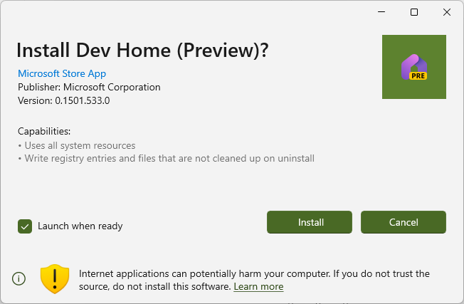

# App Installer User Interface
The App Installer provides the user interface for installation of [MSIX packages](https://learn.microsoft.com/en-us/windows/msix/overview). The interface is defined to provide the user with critical information about the package in order to make an informed decision about installing the application.

The App Installer interface consist of the following features:

* Application name
* Application icon
* Microsoft Store signature
* Publisher name
* Version
* Source
* Capabilities
* Internet warning notification
* Install and Cancel buttons
* Launch when ready

## Application name
The application name is provided by the app author, and extracted from the [MSIX file.](https://learn.microsoft.com/en-us/windows/msix/overview)

## Microsoft Store signature
If the dialog shows the string, "Microsoft Store App", you know the application has been successfully built and distributed through the Microsoft Store. Microsoft Store Signed Apps, have been tested and comply with the [Microsoft Store Policies](https://learn.microsoft.com/en-us/windows/apps/publish/store-policies)

## Publisher name and Version
The publisher name and version are provided by the app author, and extracted from the [MSIX file.](https://learn.microsoft.com/en-us/windows/msix/overview)

## Source
The source provides the domain of the URL that the package was sourced from. This allows the user to interrogate the package better when the Internet warning is provided. If you do not trust the source, do not install this software.

## Capabilities
The listing of the [capabilities](https://learn.microsoft.com/en-us/windows/uwp/packaging/app-capability-declarations) allows the you to evaluate what the application can access on your PC before installing it. If the application is accessing a capability you do not agree with, it is recommended you choose cancel.

## Install and Cancel buttons
The Install and Cancel buttons will generally be provided when installing applications. If you are downgrading an application or reinstalling the application, the text of the Install button will change to Reinstall.

The Cancel button will allow the user a chance to dismiss the dialog and avoid installing the application.

## Launch when ready
Because the App Installer improves the installation process, it can automatically start the app following installation. This is a check box control the user can uncheck.

## Internet Warning
App Installer will display an internet application warning for applications that are installing from the internet. This warning informs the user to use caution when installing this application. As with any application installed from the internet, the user must use caution. Only install apps only from trusted sources, such as Microsoft Store, and be thoughtful about which apps you install. 
See [Protect your PC from unwanted software](https://support.microsoft.com/en-us/windows/protect-your-pc-from-unwanted-software-074a2d74-02db-03dd-8340-9e1822377856) for more information.

